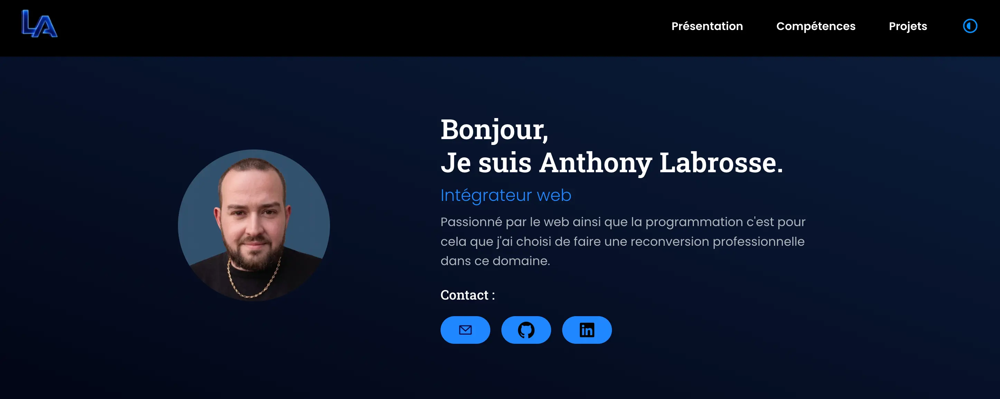

# Portfolio d'Anthony Labrosse - Intégrateur Web

 

* Ce travail a été réalisé dans le cadre du projet 12 de la formation Intégrateur Web d'OpenClassrooms.
* Ce projet est mon portfolio professionnel en ligne, conçu pour présenter mon parcours, mes compétences et mes réalisations.

**Contexte et objectifs :**
* L'objectif de ce projet était de créer une vitrine professionnelle complète en utilisant une architecture moderne.
* Le site devait répondre aux exigences suivantes :
  * Création d'une Single Page Application (SPA) performante avec React.
  * Développement d'une interface dynamique, accessible et 100% responsive (approche Mobile First).

**Fonctionnalités :**
* **Thème dynamique (Dark/Light mode) :** Changement de thème géré globalement via React et des variables CSS personnalisées.
* **Carrousel infini sur mesure :** Un slider de projets fonctionnant en boucle infinie grâce à une logique mathématique de clonage des éléments et d'écoute des transitions CSS.
* **Modales dynamiques :** Affichage détaillé des projets via des modales gérant proprement le dépassement de texte (overflow) sur mobile et desktop.
* **Données centralisées :** L'ensemble des projets est généré dynamiquement à partir d'un fichier de données JSON.

---

### Installation

Pour lancer le projet localement (géré avec Vite) :

1. Cloner le dépôt GitHub.
2. Installer les dépendances : `npm install`
3. Lancer l'environnement de développement : `npm run dev`
4. L'application est alors accessible à l'adresse indiquée dans le terminal (généralement : `http://localhost:5173`)

---

### Outils et langages pour la réalisation du projet

* Le projet a été réalisé en **HTML5, CSS3, JavaScript** et **React**.
* L'environnement de développement et le build sont gérés par **Vite**.
* Le style est entièrement réalisé en CSS natif (sans framework) avec une utilisation avancée des **variables CSS** pour la gestion des thèmes.
* L'application est développée sans back-end, en utilisant un fichier **JSON** pour stocker les données des projets.
